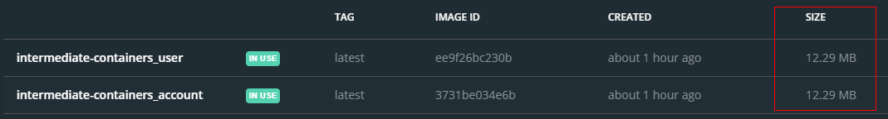

# intermediate-containers

## How to run

>  docker-compose up -d  

Services can be accessed by
- localhost:8010
- localhost:8081

## What is this project for?

Showing Docker's capability in building images. Created images are very small size.  

  

Intermediate images are used as build environment and then the executable is taken to new container. It results in very small size of output containers.
